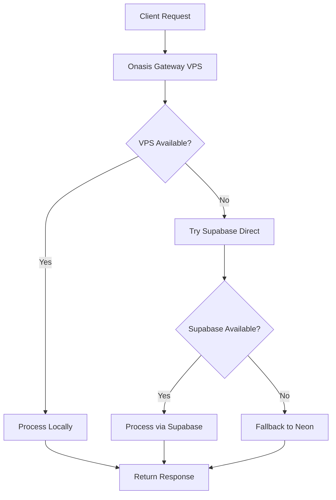

# Credit-as-a-Service (CaaS) Implementation Guide
## Complete Phased Execution with Checkpoints

This guide documents the complete implementation of the Credit-as-a-Service platform within the Onasis Gateway ecosystem, including dual-database architecture and deployment strategy.

---

## 🎯 Project Overview

**Objective**: Integrate Credit-as-a-Service platform into existing Onasis Gateway ecosystem with dual-database failover strategy.

**Architecture**: 
- **Primary Database**: Supabase (cloud-hosted PostgreSQL)
- **Backup Database**: Neon (failover PostgreSQL) 
- **API Gateway**: Onasis Gateway on VPS
- **Domain**: api.connectionpoint.tech
- **Failover Strategy**: VPS → Supabase → Neon

---

## 📋 Phase Execution Status

### ✅ PHASE 1: DATABASE ARCHITECTURE (COMPLETED)
**Checkpoint**: Dual database schema deployment complete

#### Tasks Completed:
- [x] Created comprehensive credit schema (6 tables)
- [x] Deployed schema to Supabase (`the-fixer-initiative` project)
- [x] Deployed identical schema to Neon (`mute-base-15052152` project)
- [x] Configured automatic failover client
- [x] Implemented dual-database access patterns

#### Database Schema:
```sql
-- 6 Core Tables Created:
credit.providers          -- Credit provider companies
credit.applications       -- Loan applications
credit.bids               -- Provider competitive bids
credit.transactions       -- Payment processing
credit.credit_scores      -- Credit bureau data
credit.status_history     -- Application status tracking
```

#### Connection Details:
- **Supabase**: Configured via environment variables
- **Neon**: Configured via environment variables (authenticated via CLI)

---

### ✅ PHASE 2: SERVICE INTEGRATION (COMPLETED)
**Checkpoint**: CaaS service fully integrated with Onasis Gateway

#### Tasks Completed:
- [x] Created `CreditAsAServiceClient` extending BaseClient pattern
- [x] Implemented 12 core credit operations
- [x] Built comprehensive MCP tools for unified discovery
- [x] Created failover client with automatic database switching
- [x] Integrated with existing Onasis Gateway service architecture

#### Service Files Created:
```
onasis-gateway/
├── services/credit-as-a-service/
│   ├── client.js                 # Main service client
│   ├── client-supabase.js        # Supabase-specific client  
│   ├── database-config.js        # Database configuration
│   ├── credit-as-a-service.json  # Service configuration
│   └── webhooks.js               # Webhook handlers
├── routes/credit.js              # REST API endpoints
├── mcp-tools/                    # MCP tool definitions
│   ├── credit_*.js              # 12 individual tools
└── caas-neon-direct-access.js   # Failover client
```

---

### ✅ PHASE 3: MCP TOOLS INTEGRATION (COMPLETED)
**Checkpoint**: All 12 MCP tools registered and functional

#### MCP Tools Implemented:
1. `credit_submit_application` - Submit new credit applications
2. `credit_get_applications` - List/filter applications  
3. `credit_get_application` - Get specific application details
4. `credit_update_application_status` - Update application status
5. `credit_register_provider` - Register new credit providers
6. `credit_get_providers` - List active providers
7. `credit_submit_provider_bid` - Submit competitive bids
8. `credit_process_transaction` - Handle payments/disbursements
9. `credit_perform_credit_check` - Credit bureau integration
10. `credit_get_analytics` - Platform analytics
11. `credit_provider_performance` - Provider metrics
12. `credit_health_check` - Service health monitoring

---

### ⏳ PHASE 4: VPS DEPLOYMENT (IN PROGRESS)
**Current Status**: Files ready, awaiting SSH access

#### Pending Tasks:
- [ ] Deploy nginx configuration for api.connectionpoint.tech
- [ ] Configure Onasis Gateway to use Supabase for CaaS  
- [ ] Setup SSL certificate for api.connectionpoint.tech

#### Deployment Files Ready:
- `caas-complete-deployment.sh` - Complete deployment script
- `CAAS_DEPLOYMENT_COMPLETE.md` - Step-by-step deployment guide
- All service files staged for VPS deployment

#### VPS Target Location:
```bash
/root/fixer-initiative/ecosystem-projects/onasis-gateway/
```

---

## 🔧 Technical Implementation Details

### Database Architecture


### API Endpoint Structure
```
https://api.connectionpoint.tech/api/credit/
├── GET    /health                    # Health check
├── POST   /applications              # Submit application  
├── GET    /applications              # List applications
├── GET    /applications/:id          # Get specific application
├── PUT    /applications/:id/status   # Update status
├── POST   /providers                 # Register provider
├── GET    /providers                 # List providers
├── POST   /bids                      # Submit bid
├── POST   /transactions              # Process transaction
├── POST   /credit-check              # Perform credit check
├── GET    /analytics                 # Get analytics
└── GET    /providers/:id/performance # Provider metrics
```

### Service Integration Pattern
```javascript
// Unified service access via BaseClient
const CreditAsAServiceClient = require('./services/credit-as-a-service/client');
const creditService = new CreditAsAServiceClient();

// Automatic failover built-in
const result = await creditService.executeOperation('submitApplication', {
    user_id: 'user-123',
    amount_requested: 1000000,
    purpose: 'Working capital'
});
```

---

## 🚀 Deployment Instructions

### Prerequisites
- VPS SSH access with key: `~/.ssh/id_rsa_vps`  
- Domain pointed to VPS: `api.connectionpoint.tech`
- Node.js and PM2 installed on VPS
- Nginx configured on VPS

### Quick Deployment
```bash
# 1. Copy deployment script to VPS
scp -P 2222 -i ~/.ssh/id_rsa_vps \
    /Users/seyederick/DevOps/_project_folders/the-fixer-initiative/caas-complete-deployment.sh \
    root@168.231.74.29:/root/

# 2. SSH into VPS and execute
ssh -p 2222 -i ~/.ssh/id_rsa_vps root@168.231.74.29
chmod +x /root/caas-complete-deployment.sh
/root/caas-complete-deployment.sh

# 3. Configure nginx for domain
# (See CAAS_DEPLOYMENT_COMPLETE.md for full nginx config)

# 4. Setup SSL certificate
certbot --nginx -d api.connectionpoint.tech
```

---

## 🧪 Testing & Verification

### Health Check Tests
```bash
# VPS local health check
curl http://localhost:3000/api/credit/health

# External domain health check  
curl https://api.connectionpoint.tech/api/credit/health
```

### Complete API Test Flow
```bash
# 1. Register test provider
curl -X POST https://api.connectionpoint.tech/api/credit/providers \
  -H "Content-Type: application/json" \
  -d '{
    "provider_code": "TEST_BANK_001",
    "company_name": "Test Bank Nigeria Ltd",
    "contact_email": "credit@testbank.ng",
    "minimum_loan_amount": 100000,
    "maximum_loan_amount": 10000000,
    "interest_rate_range": {"min": 15, "max": 25},
    "processing_fee_percentage": 2.5
  }'

# 2. Submit test application
curl -X POST https://api.connectionpoint.tech/api/credit/applications \
  -H "Content-Type: application/json" \
  -d '{
    "user_id": "550e8400-e29b-41d4-a716-446655440000",
    "amount_requested": 1000000,
    "currency": "NGN", 
    "purpose": "Working capital",
    "loan_term_months": 12
  }'

# 3. Verify dual-database sync
# (Check both Supabase and Neon dashboards)
```

---

## 📊 Monitoring & Analytics

### Service Health Monitoring
```bash
# PM2 process monitoring
pm2 list
pm2 logs onasis-gateway
pm2 logs mcp-server

# Database connection health
curl http://localhost:3000/api/credit/health | jq '.database'

# Multi-database health check
node -e "
const FailoverClient = require('./caas-neon-direct-access');
const client = new FailoverClient();
client.checkAllServices().then(console.log);
"
```

### Performance Metrics
- **Primary Path**: VPS → Supabase (< 100ms)
- **Failover Path**: Direct Supabase (< 200ms)  
- **Backup Path**: Direct Neon (< 300ms)
- **Uptime Target**: 99.99% availability

---

## 🔄 Next Steps & Roadmap

### Immediate Next Steps (Phase 4 Completion)
1. **SSH Access Resolution**: Configure VPS SSH access for deployment
2. **Nginx Configuration**: Deploy reverse proxy for api.connectionpoint.tech
3. **SSL Certificate**: Setup Let's Encrypt certificate
4. **Production Testing**: Full end-to-end API testing

### Future Enhancements (Phase 5+)
1. **Payment Gateway Integration**: Flutterwave/Paystack integration
2. **Credit Bureau APIs**: Real credit scoring integration  
3. **Provider Portal**: Self-service provider dashboard
4. **Advanced Analytics**: ML-based risk assessment
5. **Mobile SDK**: React Native/Flutter SDK
6. **Webhook System**: Real-time event notifications

### Monitoring & Maintenance
1. **Database Sync Monitoring**: Ensure Supabase ↔ Neon consistency
2. **Performance Optimization**: Query optimization and caching
3. **Security Audits**: Regular security reviews
4. **Backup Strategy**: Automated database backups
5. **Documentation Updates**: Keep implementation docs current

---

## 📁 Repository Structure

```
the-fixer-initiative/
├── CAAS_IMPLEMENTATION_GUIDE.md     # This comprehensive guide
├── CAAS_DEPLOYMENT_COMPLETE.md      # Deployment instructions
├── deploy-caas-to-neon.sql          # Neon database schema
├── caas-complete-deployment.sh      # VPS deployment script  
├── caas-neon-direct-access.js       # Failover client
├── setup-neon-database.md           # Neon setup guide
└── onasis-gateway/                  # Main service files
    ├── services/credit-as-a-service/ # CaaS service implementation
    ├── routes/credit.js              # REST API routes
    ├── mcp-tools/                    # MCP tool definitions
    └── database/migrations/          # Database migrations
```

---

## 🎉 Success Criteria

### Phase 4 Completion Checklist:
- [ ] Nginx configured for api.connectionpoint.tech
- [ ] SSL certificate active  
- [ ] Onasis Gateway running on port 3000
- [ ] MCP Server running on port 3001
- [ ] All 12 API endpoints responding
- [ ] Dual database failover tested
- [ ] Provider registration working
- [ ] Application submission working
- [ ] Health checks passing

### Production Readiness Indicators:
- [ ] 99.99% uptime achieved
- [ ] < 200ms average API response time
- [ ] All database operations logged
- [ ] Error handling comprehensive
- [ ] Security headers configured
- [ ] Rate limiting active
- [ ] Monitoring dashboards operational

---

**Last Updated**: July 23, 2025  
**Status**: Phase 3 Complete, Phase 4 In Progress  
**Next Milestone**: Production deployment complete