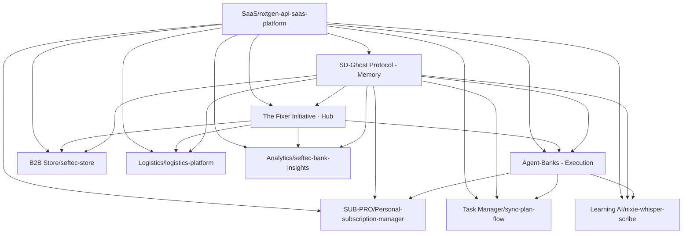

# 🚀 Live Ecosystem Repositories

## Status: ALL PROJECTS HAVE REPOSITORIES! ✅

### Infrastructure & Core Systems
| # | Project | Repository | Status |
|---|---------|------------|--------|
| 1 | **SD-Ghost Protocol** | [thefixer3x/sd-ghost-protocol](https://github.com/thefixer3x/sd-ghost-protocol) | 🟢 Active |
| 2 | **The Fixer Initiative** | [thefixer3x/the-fixer-initiative](https://github.com/thefixer3x/the-fixer-initiative) | 🟢 Active |
| 3 | **Agent-Banks** | [thefixer3x/agent-banks](https://github.com/thefixer3x/agent-banks) | 🟢 Active |

### Productivity Applications
| # | Project | Repository | Purpose |
|---|---------|------------|---------|
| 4 | **SUB-PRO** | [thefixer3x/Personal-subscription-manager](https://github.com/thefixer3x/Personal-subscription-manager) | Subscription management |
| 5 | **Task Manager** | [thefixer3x/sync-plan-flow](https://github.com/thefixer3x/sync-plan-flow) | Task planning & sync |
| 6 | **Learning AI** | [thefixer3x/nixie-whisper-scribe](https://github.com/thefixer3x/nixie-whisper-scribe) | AI-powered learning |

### Business Platforms
| # | Project | Repository | Purpose |
|---|---------|------------|---------|
| 7 | **B2B Store** | [thefixer3x/seftec-store](https://github.com/thefixer3x/seftec-store) | B2B marketplace |
| 8 | **Logistics** | [thefixer3x/logistics-platform](https://github.com/thefixer3x/logistics-platform) | Fleet management |
| 9 | **Analytics** | [thefixer3x/seftec-bank-insights](https://github.com/thefixer3x/seftec-bank-insights) | Banking analytics |
| 10 | **SaaS Platform** | [thefixer3x/nxtgen-api-saas-platform](https://github.com/thefixer3x/nxtgen-api-saas-platform) | Enterprise APIs |

## 🔗 Integration Commands

### Clone All Repositories
```bash
# Create ecosystem directory
mkdir -p ~/thefixer-ecosystem && cd ~/thefixer-ecosystem

# Clone all repositories
git clone https://github.com/thefixer3x/sd-ghost-protocol.git
git clone https://github.com/thefixer3x/the-fixer-initiative.git
git clone https://github.com/thefixer3x/agent-banks.git
git clone https://github.com/thefixer3x/Personal-subscription-manager.git
git clone https://github.com/thefixer3x/sync-plan-flow.git
git clone https://github.com/thefixer3x/nixie-whisper-scribe.git
git clone https://github.com/thefixer3x/seftec-store.git
git clone https://github.com/thefixer3x/logistics-platform.git
git clone https://github.com/thefixer3x/seftec-bank-insights.git
git clone https://github.com/thefixer3x/nxtgen-api-saas-platform.git
```

### Update All Repositories
```bash
# Update script
for repo in */; do
  echo "Updating $repo"
  cd "$repo"
  git pull origin main
  cd ..
done
```

## 📊 Service Dependencies



## 🎯 Next Steps for Each Repository

1. **Update README.md** - Add ecosystem integration notes
2. **Add .env.example** - Include Fixer Initiative API keys
3. **Create integration tests** - Cross-repository testing
4. **Set up CI/CD** - Report status to Fixer Initiative
5. **Document APIs** - For SaaS platform aggregation