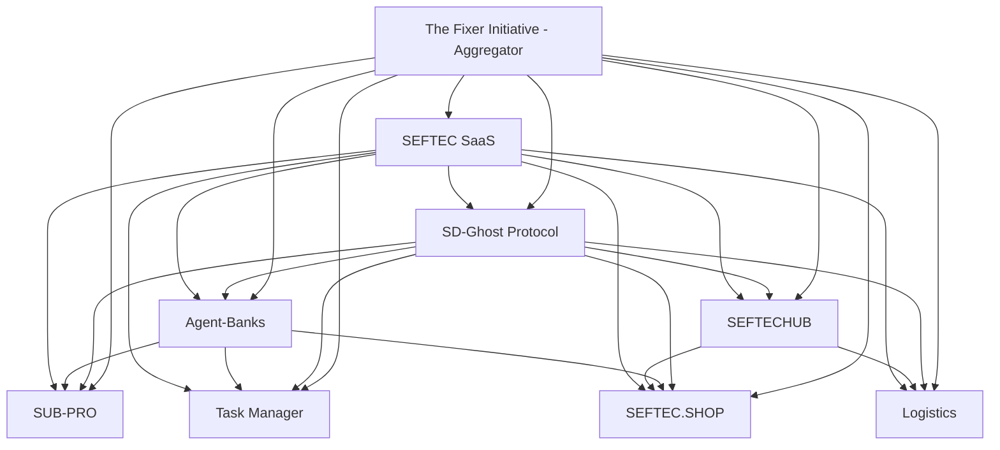

# Ecosystem Repository Links

## 🔗 Active Repositories

### Infrastructure Layer
| Project | Repository | Status | Integration Points |
|---------|------------|--------|-------------------|
| **SD-Ghost Protocol** | [github.com/thefixer3x/sd-ghost-protocol](https://github.com/thefixer3x/sd-ghost-protocol) | 🟢 Active | Memory-as-a-Service foundation |
| **The Fixer Initiative** | [github.com/thefixer3x/the-fixer-initiative](https://github.com/thefixer3x/the-fixer-initiative) | 🟢 Active | Central aggregator hub |

### Execution Layer
| Project | Repository | Status | Integration Points |
|---------|------------|--------|-------------------|
| **Agent-Banks** | [github.com/thefixer3x/agent-banks](https://github.com/thefixer3x/agent-banks) | 🟢 Active | AI execution engine |

### Consumer Applications
| Project | Repository | Status | Integration Points |
|---------|------------|--------|-------------------|
| **SUB-PRO** | [Pending Creation] | 🟡 Development | Subscription management |
| **Task Manager** | [Pending Creation] | 🟡 Development | AI productivity assistant |
| **SEFTEC.SHOP** | [Pending Creation] | 🟡 Development | Smart shopping marketplace |

### Business Platforms
| Project | Repository | Status | Integration Points |
|---------|------------|--------|-------------------|
| **SEFTECHUB** | [Pending Creation] | 🟡 Development | B2B trade hub |
| **Logistics Platform** | [Pending Creation] | 🟡 Development | Fleet management |
| **SEFTEC SaaS** | [Pending Creation] | 🟡 Development | Enterprise API platform |

## 📊 Repository Integration Matrix



## 🔧 Repository Setup Commands

### For Existing Repositories
```bash
# Clone and link existing repos
git clone https://github.com/thefixer3x/sd-ghost-protocol.git
git clone https://github.com/thefixer3x/the-fixer-initiative.git
git clone https://github.com/thefixer3x/agent-banks.git
```

### For New Repositories (when ready)
```bash
# Create new repos when projects are ready
gh repo create sub-pro --public --description "Intelligent subscription management platform"
gh repo create task-manager --public --description "AI-powered productivity assistant"
gh repo create seftechub --public --description "B2B trade hub for SME growth"
gh repo create seftec-shop --public --description "Smart shopping marketplace with AI"
gh repo create logistics-platform --public --description "Fleet management and delivery orchestration"
gh repo create seftec-saas --public --description "Enterprise API and SDK marketplace"
```

## 🔄 Continuous Integration

### GitHub Actions Workflow
Each repository should have CI/CD that reports status back to The Fixer Initiative aggregator.

### Status Webhook
```yaml
# In each repo's .github/workflows/status.yml
- name: Report Status to Aggregator
  run: |
    curl -X POST https://api.connectionpoint.tech/v1/repo-status \
      -H "Authorization: Bearer ${{ secrets.FIXER_API_KEY }}" \
      -d '{"repo": "${{ github.repository }}", "status": "${{ job.status }}"}'
```

## 📈 Monitoring Dashboard

Access the central monitoring dashboard at:
- **Development**: http://localhost:3000/repos
- **Production**: https://control.fixer-initiative.com/repos

This dashboard shows:
- Build status for each repository
- Latest commits and releases
- Integration test results
- Cross-repo dependency health
- API usage across projects